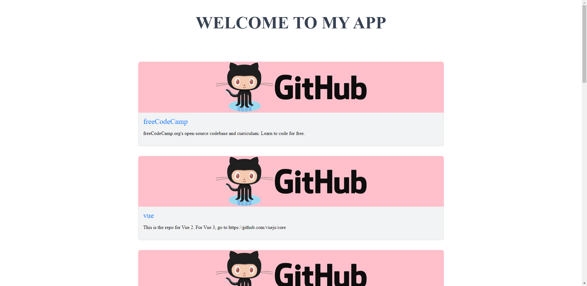

# Simple react/typescript app with rtk-queries and graphql [in dev]

This project lists the most starred typescript github repos. Workspace has been created by [Nx](https://nx.dev) and uses [Vite](https://vitejs.dev/) build tool.

## Running Demo

Run `nx serve` for a dev server. Navigate to http://127.0.0.1:4200/. The app will automatically reload if you change any of the source files.

## Screenshots

## Understand this workspace

Run `nx graph` to see a diagram of the dependencies of the projects.

## Remote caching

Run `npx nx connect-to-nx-cloud` to enable [remote caching](https://nx.app) and make CI faster.

## Tech Stack

React, Typescript, Redux Toolkit [RTK Query], GraphQL, NX, Vite, Jest, SCSS

## Feedback

If you have any feedback, please reach out to me or feel free to open up a issue.

## License

[MIT](/LICENSE)
